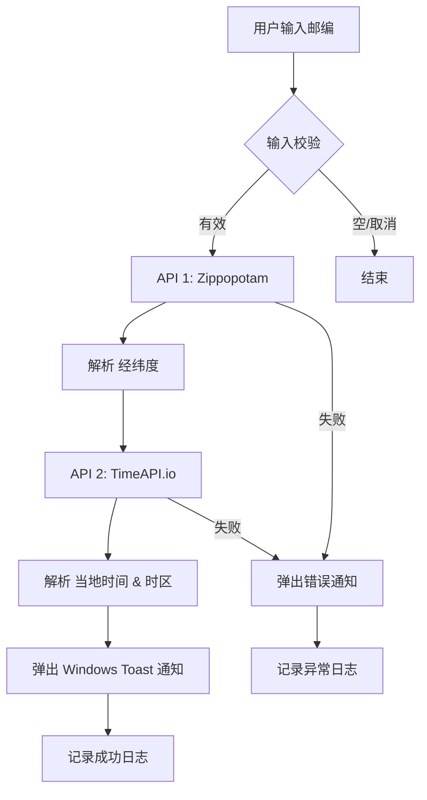
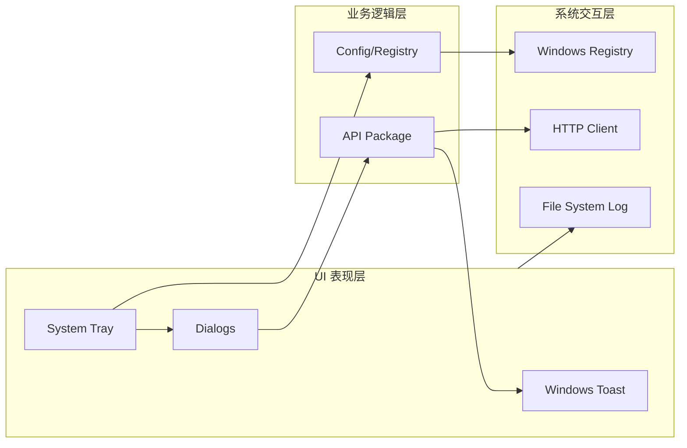

# 🌍 ZoneTray - 美国邮编时区查询工具

<p align="center">
  
</p>

<p align="center">
  
  
  
  
</p>

---

**ZoneTray** 是一个用 Go 语言编写的轻量级 Windows 托盘工具。它专为需要频繁核对美国时区的用户设计，通过简单的邮编输入，即可瞬间获取当地时间，并以优雅的系统通知形式呈现。

## ✨ 核心特性

- **📥 极简交互**：右键点击托盘图标 -> 输入邮编 -> 获取结果。无需打开臃肿的窗口。
- **🔔 系统集成**：利用 Windows Native Toast 发送通知，支持在通知中心查看历史记录。
- **⚙️ 智能自启**：内置设置菜单，一键写入/删除注册表启动项。
- **🛡️ 极致稳定**：
  - **非阻塞 UI**：每个查询任务都在独立的 Goroutine 中运行，托盘菜单响应永不延迟。
  - **底层锁程**：使用 `runtime.LockOSThread` 解决 Win32 对话框在 Go 调度下的卡死痛点。
  - **现代样式**：嵌入 Windows Manifest，确保对话框遵循最新 Windows 10/11 视觉规范。
- **📝 透明运行**：自动维护 `zonetray.log`，所有 API 请求与系统异常均可追溯。

## 🛠️ 技术原理

### 查询工作流
程序采用链式请求逻辑，确保数据的准确性：



### 底层架构


## 🚀 快速上手

### 直接运行 (推荐)
从 [Releases](https://github.com/IKUN-PEPE/TimeZoneTray/releases) 页面下载最新的 `ZoneTray.exe`，双击即可使用。

### 手动编译
如果你想从源码构建：

```powershell
# 克隆仓库
git clone https://github.com/IKUN-PEPE/TimeZoneTray.git
cd TimeZoneTray

# 安装资源工具 (仅需运行一次)
go install github.com/akavel/rsrc@latest
rsrc -manifest ZoneTray.exe.manifest -ico assets/icon.ico -o icon.syso

# 编译 (隐藏黑窗口 + 压缩体积)
go build -ldflags "-H windowsgui -s -w" -o ZoneTray.exe
```

## 📂 项目结构

| 路径 | 职责 |
| :--- | :--- |
| `main.go` | **主程序**：负责托盘初始化、事件循环、并发调度和通知触发。 |
| `api/` | **核心逻辑**：封装了两个地理/时间 API 的请求解析，包含 TDD 测试用例。 |
| `config/` | **系统设置**：管理 `config.json` 的读写，以及 Windows 注册表自启逻辑。 |
| `assets/` | **静态资源**：存放原始 JPG 图片及转换后的多尺寸 ICO 图标。 |
| `zonetray.log`| **运行日志**：记录程序从启动到关闭的全过程，便于排查网络或 UI 冲突问题。 |

## 📝 许可证

本项目采用 [MIT License](LICENSE) 开源。

---
<p align="center">
  Made with ❤️ for efficiency by IKUN-PEPE
</p>
